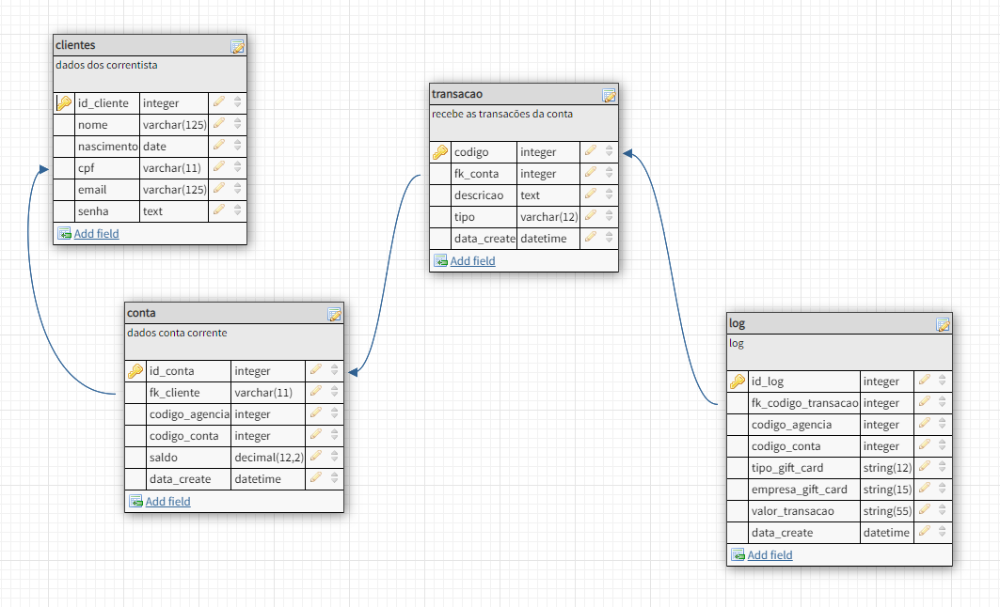
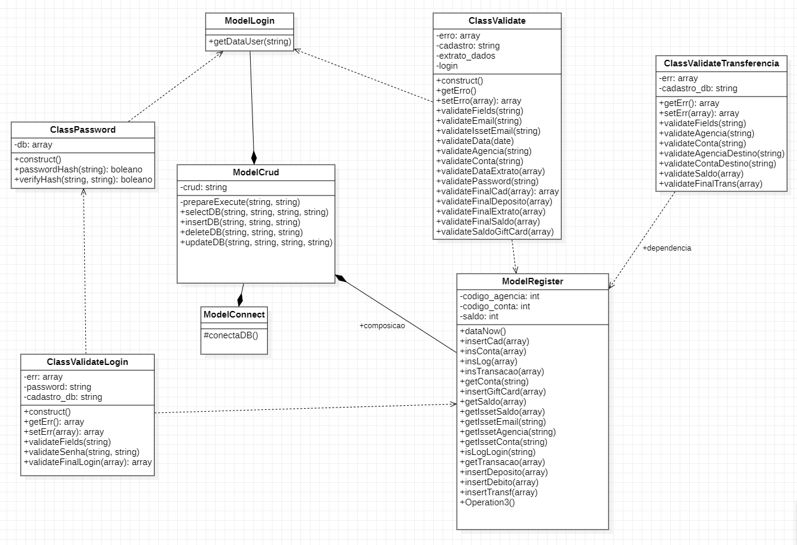

<h1 align="center"> System Auto Bank Em PHP</h1>
 

 
     

 Desafio Dev Back End | W3 

## Como executar este project 

1 - Use os campos do arquivo variables para criar suas tables

### 2 - Faça as Instalações: :books: 
- [PHP 8.1](https://www.php.net/)
- [COMPOSER](https://getcomposer.org)
- [XAMPP](https://www.apachefriends.org/pt_br/index.html)

### 3 - abra a pasta do project e execute:
`composer update`
isto irá configurar o arquivo composer.json 

### 4 - Não esqueça de verificar os arquivos abaixos, e fazer os configurações necessário.
    4.1 htaccess 
    4.2 config 
    4.3 e os arquivos que se encontram no diretório js

## Lista de Tarefas
1. nova conta corrente. Concluido

    - [x] inserção table clientes
    - [x] inserção table conta
    - [x] inserção table log
    - [x] inserção table transção

    - 1.1 Validações 
        - [x] Exceção 1. O sistema validará se o cliente é maior de 17 Anos :heavy_check_mark:
        - [x] Exceção 2. O sistema validará se a senha possuir os 6 dígitos, apenas números, e não repetidos :heavy_check_mark:
        - [x] Exceção 3. O sistema validará se a senha possuir no mínimo 6 dígitos :heavy_check_mark:

2. Login system. Concluído
    
    - [x] login
    - [x] inserção table log
    - [x] inserção table transção

    - 2.1 Validações
        - [x] Exceçã 1. O sistema avalia se a agência existe :heavy_check_mark:
        - [x] Exceçã 2. O sistema avalia se a conta existe :heavy_check_mark:
        - [x] Exceçã 3. O sistema avalia se a senha está correta :heavy_check_mark:

3. Consultar Saldo Conta Corrente. Concluido 
    
    3.1 Validações
    - [x] Exceção 1. O sistema avalia se a agência existe  :heavy_check_mark:
    - [x] Exceção 2. O sistema avalia se a agência conta corrente  :heavy_check_mark:

4. Consultar Extrato Conta Corrente. Em desenvolvimento :warning: 
    - [x] Exceção 1. O sistema avalia se a agência existe  :heavy_check_mark:
    - [x] Exceção 2. O sistema avalia se a agência conta corrente  :heavy_check_mark:
    - [x] Exceção 3. O sistema avalia se as datas inicial e final são válidas :heavy_check_mark:

5. Comprar Gift Card: Concluído
    - [x] Exceção 1. O sistema avalia se a agência existe  :heavy_check_mark:
    - [x] Exceção 2. O sistema avalia se a agência conta corrente  :heavy_check_mark:
    - [x] Exceção 3. O sistema avalia se a conta corrente tem saldo suficiente  :heavy_check_mark:

6. Transferência entre Contas. Concluído
    - [x] Exceção 1. O sistema avalia se a agência de origem existe  :heavy_check_mark:
    - [x] Exceção 2. O sistema avalia se a conta de origem existe  :heavy_check_mark:
    - [x] Exceção 3. O sistema avalia se a agência de destino existe  :heavy_check_mark:
    - [x] Exceção 4. O sistema avalia se a conta de destino existe  :heavy_check_mark:
    - [x] Exceção 5. O sistema avalia se a conta de origem possue saldo suficiente :heavy_check_mark:
 
    
### 2 - Principais Referências: :books: 
- [Web Design Em Foco](https://www.webdesignemfoco.com//)
- [Celke](https://celke.com.br/)
- [PHP DOCS](https://www.php.net/manual/pt_BR/)

 
 
 
 
